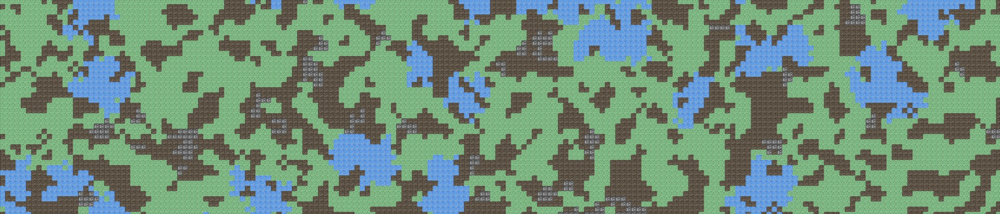

# :rocket: GameProject   

> [!note] Bienvenue
> Cette page sert de point d'entrée central pour toutes les informations essentielles concernant le projet **_GameProject_**.   




---
## :mag: Aperçu du Projet 
> [!note] 
> Bienvenue sur la page **_README_** de notre projet !   

**_GameProject_** est un jeu Pygame où vous explorez un vaste monde depuis une vue aérienne.    
Notre objectif est de livrer une expérience immersive et engageante où chaque interaction et chaque défi vous rapprochent de la sortie de ce monde.   
Le développement du jeu est simplifié grâce à l'intégration d'un **éditeur de carte** dédié (`Concepteur.py`).   


---
## :chart_with_upwards_trend: Architecture du Projet     
> [!note]  
> Information sur les fichiers et l'arborescence du projet    

* [main.py]()
: Le fichier principal du jeu, contient la boucle de jeu avec les scènes menu, jeu, etc...  

* [Concepteur.py]()
: Programme pour les développeur permettant de modifier la carte du jeu.   

* [LICENSE]()
: Document légal définissant ce que les autres peuvent faire avec le code.    

* [Files/]()
: Répertoire contenant l'ensemble des fichiers python.

* [Files/config.py]()
: Fichier de configuration pour les dimensions de l'écran, le titre, etc.   

* [Files/generation_procedurale.py]()
: Fichier permettant comme son nom l'indique de généré une carte (**principalement _Automate Cellular_**)   

* [Files/textures_manager.py]()
:  Gère le chargement et la mise à l'échelle des textures, ainsi que la préparation de la grille et des données de collision.   

* [Files/Lecteur_map.py]()
: Permet de lire et modifier le fichier JSON.     

* [Assets/]()
: Contient toutes les ressources du jeu (images, sons, etc.)   

* [Saves/]()
: Contient L'ensemble des cartes du jeu (fichiers JSON).  

* [.gitignore]()
: Spécifie les fichiers et répertoires que Git doit ignorer et ne pas suivre, afin d'éviter qu'ils ne soient accidentellement ajoutés aux commits. (Ex: les .log)  


---
## :joystick: Les commandes du jeu:
* <kbd>Z</kbd>,<kbd>Q</kbd>,<kbd>S</kbd>,<kbd>D</kbd> et les <kbd>flèches directionnelles</kbd> : pour ce déplacer   
* <kbd>SHIFT</kbd> + <kbd>Z</kbd>/<kbd>Q</kbd>/<kbd>S</kbd>/<kbd>D</kbd>/<kbd>flèches directionnelles</kbd> : pour ce déplacer + vite    
...


---
## :play_button: Démarrage Rapide    
> [!note]
> Pour cloner le projet, installer les dépendances et lancer le jeu en local :   

Cloner ce dépôt en bash:   
```bash
git clone https://gitlab.univ-lr.fr/projets-l2-2025/eco.io/gameproject.git
``` 

installer les dépendances:   
* [Python (la version la plus récente)](https://www.python.org/downloads/)
* Pygame avec la commande ```pip install pygame```

Lancez le jeu avec:    
```main.py```

Lancez le mode éditeur avec:   
```Concepteur.py```


---
## :scroll: Licence
Ce projet est distribué sous la [licence MIT](LICENSE)


---
## :bust_in_silhouette: Auteurs
| <a href="https://gitlab.univ-lr.fr/mferna08">  </a> | **Nom :** _Fernandez Mathys_ <br> **GitLab :** [mon profil](https://gitlab.univ-lr.fr/mferna08) |
|:----------------------------------------------------------------------------------------------------------------------------------:|:----------------------------------------------------------------------------------------------------:|

| <a href="https://gitlab.univ-lr.fr/rlamou01">  </a> | **Nom :** _Lamoureux Robin_ <br> **GitLab :** [mon profil](https://gitlab.univ-lr.fr/rlamou01) |
|:----------------------------------------------------------------------------------------------------------------------------------:|:----------------------------------------------------------------------------------------------------:|

| <a href="https://gitlab.univ-lr.fr/tsoilihi">  </a> | **Nom :** _Soilihi Timeo_ <br> **GitLab :** [mon profil](https://gitlab.univ-lr.fr/tsoilihi) |
|:----------------------------------------------------------------------------------------------------------------------------------:|:----------------------------------------------------------------------------------------------------:|

| <a href="https://gitlab.univ-lr.fr/tpinet">  </a> | **Nom :** _Pinet Theo_ <br> **GitLab :** [mon profil](https://gitlab.univ-lr.fr/tpinet) |
|:----------------------------------------------------------------------------------------------------------------------------------:|:----------------------------------------------------------------------------------------------------:|


---
## :information: Pour plus d'information
Aller sur la page [Home](https://gitlab.univ-lr.fr/projets-l2-2025/eco.io/gameproject/-/wikis/home) de notre projet
